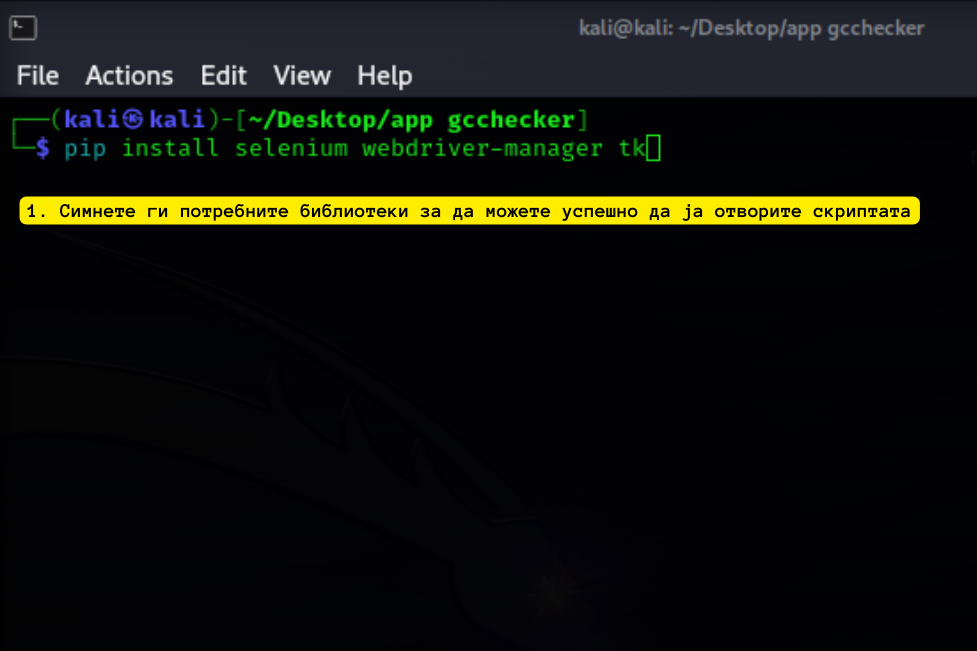
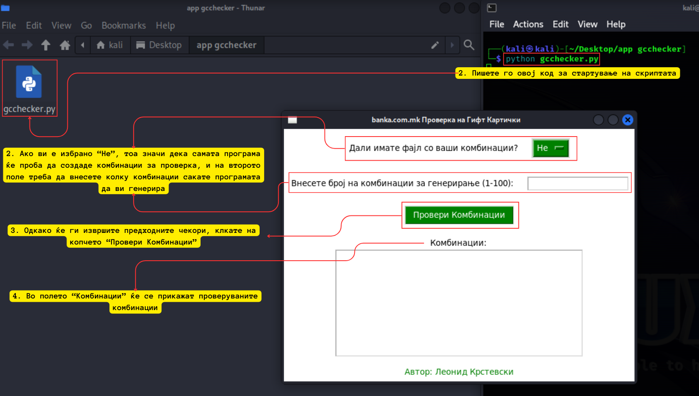
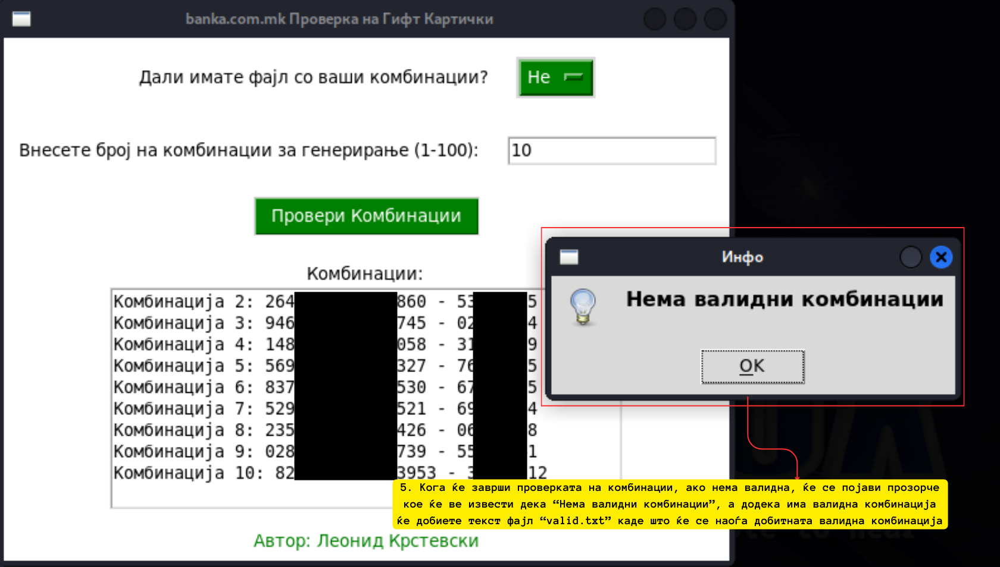
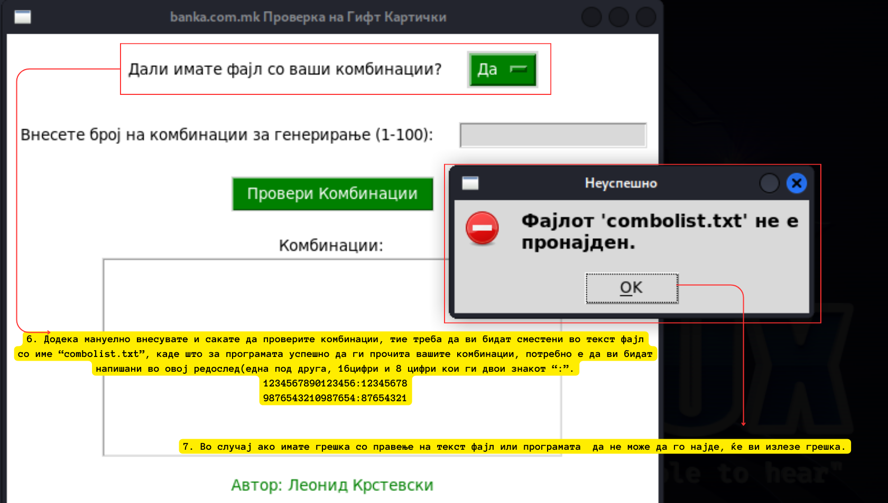

# banka.com.mk - Бот за проверка на гифт картички

Оваа апликација автоматски проверува комбинации од кодови на Гифт Картички на страницата на банката и ги зачувува валидните комбинации.

## Како се користи?

1. **Клонирајте го проектов:** Клонирајте го овој проект на вашата локална машина користејќи ја следнава команда:
```
git clone https://github.com/l3069/banka.com.mk-GiftCard-Checker.git
```
3. **Инсталирајте Python:** Проверете дали имате инсталирано Python 3.x на вашиот систем. Можете да го преземете од официјалната веб-страница на Python: https://www.python.org/downloads/

4. **Инсталирај пакети:** Инсталирајте ги потребните Пајтон пакети:
- Selenium
- Tkinter
- WebDriver


# Код инсталации:

```shell
pip install selenium webdriver-manager tk
```

1. Стартувајте ја апликацијата: започнете ја скриптата gcchecker.py користејќи Python:
```
python gcchecker.py
```
2. Изберете дали имате ваш фајл со комбинации или сакате програмата сама да ви генерира

3. Доколку немате ваш фајл со комбинации, внесете колку комбинации сакате програмата да изгенерира

4. Доколку имате вап фајл ве молам потпишете го како "combinations.txt" за да може програмата да го најде (Фајлот треба да има комбинации една под друга, 16 цифри со 8 цифри кои ги двои ":" како на сликите подолу)

6. Кога комбинациите ќе ги провери програмата и нема валидни, ќе ви се појави прозорче кое ќе ве извести, а доколку има валидни комбинации, програмата автоматски ќе ги зачува и ќе ги потпише со име "valid.txt"

## Сликовит приказ за употреба:





### Автор
Автор на овој проект е: Леонид Крстевски

### Важно!
Употребата на оваа апликација за нелегални или неетички активности, вклучувајќи го и обидот за пристапување до банкарски информации без дозвола, е строго забранета. Користењето на оваа апликација во такви контексти може да предизвика правни последици и да ја компромитира вашата безбедност и приватност, како и да предизвика сериозна штета на трети лица. Ве молиме да ја користите оваа апликација исклучиво во согласност со законските и етичките стандарди.

#### Warning: This project is not intended for any cyber disruption or illegal purposes. The author is not responsible for any misuse of this code.
